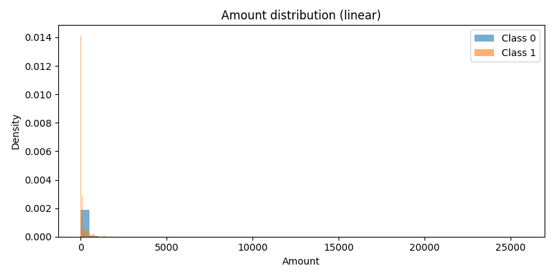
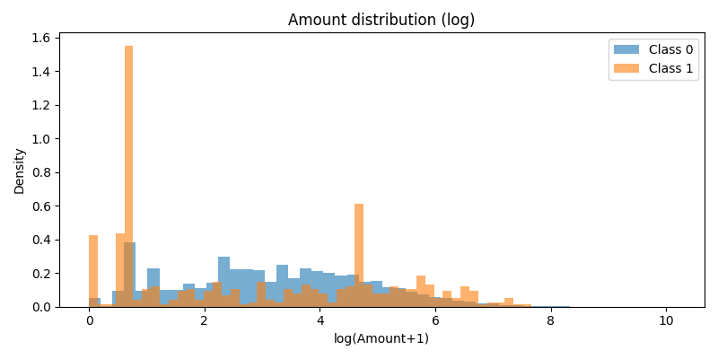
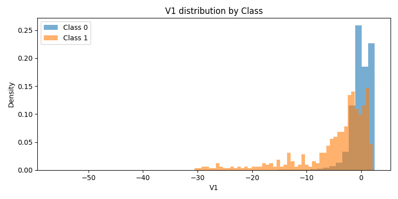
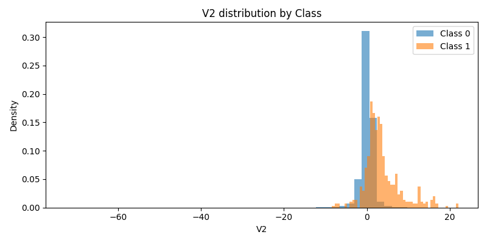
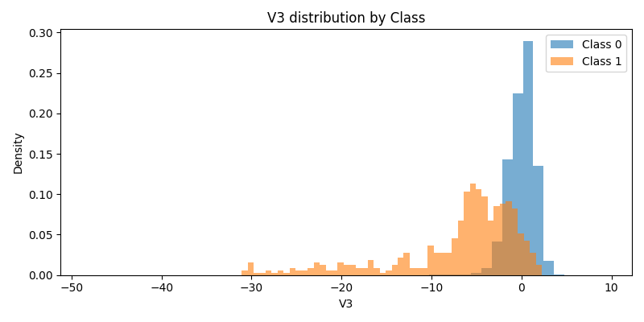

# EDA Summary for creditcard.csv

**Total rows:** 284807

**Fraud rate:** 0.001727

## Columns
Time, V1, V2, V3, V4, V5, V6, V7, V8, V9, V10, V11, V12, V13, V14, V15, V16, V17, V18, V19, V20, V21, V22, V23, V24, V25, V26, V27, V28, Amount, Class

## Basic Stats
### Time
- mean: 94813.85957508067
- median: 84692.0
- std: 47488.062585499334
- min: 0.0
- max: 172792.0
- q01: 2422.0
- q99: 170560.94

### Amount
- mean: 88.34961925093134
- median: 22.0
- std: 250.1196701352354
- min: 0.0
- max: 25691.16
- q01: 0.12
- q99: 1017.9700000000012

## Plots
- Amount (linear): 
- Amount (log1p): 
- V1: 
- V2: 
- V3: 

## Findings
- Fraud rate is low; class imbalance is present.
- Amount distribution is right-skewed; log transform helps visualization.
- PCA features V1-V3 show different distributions for fraud vs normal; some separation is visible.

